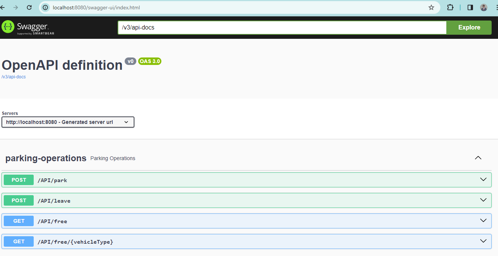

# Getting Started

### Tools

This project takes advantage of the following tools:

- OpenAPI
- Lombok

### Configuration of the project

You can configure the amount of spots for the parking lot modifying the `application.yaml` from the resources.

```yaml
parking:
  spots:
    motorcycle: {numberOfMotorcycleSpots}
    compact: {numberOfCompactSpots}
    regular: {numberOfRegularSpots}
```

### Running the project

Run the project using your preference IDE or just run the following script.

```shell
./gradlew bootRun
```

When running the project the compileJava task is already configured for generating the API specification.

### Running Tests for the application

The tests can be executed running the following script

```shell
./gradlew clean test 
```

### Manually Testing the application

After running the application, it can be tested using any tool that allow making requests or just navigate to the
following URL which contains the OpenAPI specification and you will have access for every endpoint in the application :

```
http://localhost:8080/swagger-ui/index.html
```

